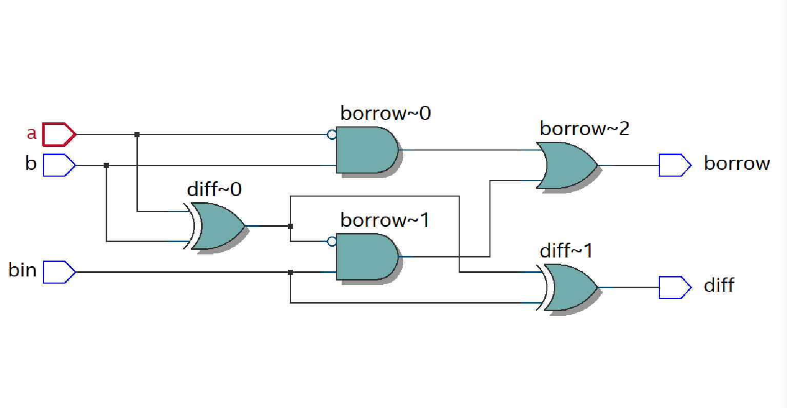
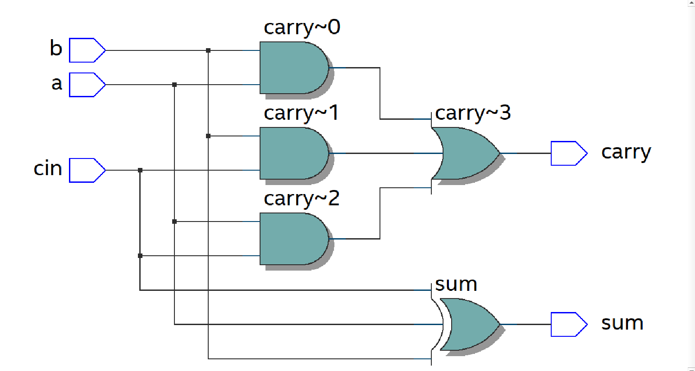

# FULL_ADDER_SUBTRACTOR

Implementation-of-Full-Adder-and-Full-subtractor-circuit

**AIM:**

To design a Full Adder and Full Subtractor circuit and verify its truth table in Quartus using Verilog programming.

**Equipments Required:**

Hardware – PCs, Cyclone II , USB flasher

Software – Quartus prime

**Full Adder and Full Subtractor**

**Full Adder**

Full adder is a digital circuit used to calculate the sum of three binary bits. It consists of three inputs and two outputs. Two of the input variables, denoted by A and B, represent the two significant bits to be added. The third input, Cin, represents the carry from the previous lower significant position. Two outputs are necessary because the arithmetic sum of three binary digits ranges in value from 0 to 3, and binary 2 or 3 needs two digits. The two outputs are sum and carry.

Sum =A’B’Cin + A’BCin’ + ABCin + AB’Cin’ = A ⊕ B ⊕ Cin 

Carry = AB + ACin + BCin


**Figure -1 FULL ADDER**

**Full Subtractor**

A full subtractor is a combinational circuit that performs subtraction involving three bits, namely minuend, subtrahend, and borrow-in . It accepts three inputs: minuend, subtrahend and a borrow bit and it produces two outputs: difference and borrow.


Diff = A ⊕ B ⊕ Bin 

Borrow out = A'Bin + A'B + BBin

**Truthtable**

**Procedure**

Write the detailed procedure here

**Program:**
**FULL ADDER**

```
module full_adder (
    input  wire a, b, cin,   // Inputs
    output wire sum, carry   // Outputs
);

    // Logic equations
    assign sum   = a ^ b ^ cin;                  // XOR for sum
    assign carry = (a & b) | (b & cin) | (a & cin); // Majority function for carry

endmodule
```
**FULL SUBTRACTOR**
```
module full_subtractor (
    input  wire a, b, bin,       // Inputs
    output wire diff, borrow     // Outputs
);

    // Logic equations
    assign diff   = a ^ b ^ bin;                  // Difference
    assign borrow = (~a & b) | (~(a ^ b) & bin);  // Borrow logic

endmodule
```

**RTL Schematic**
**FULL ADDER**

**FULL SUBTRACTOR**


**Output Timing Waveform**
**FULL ADDER**

**FULL SUBTRACTOR**


**Result:**

Thus the Full Adder and Full Subtractor circuits are designed and the truth tables is verified using Quartus software.


